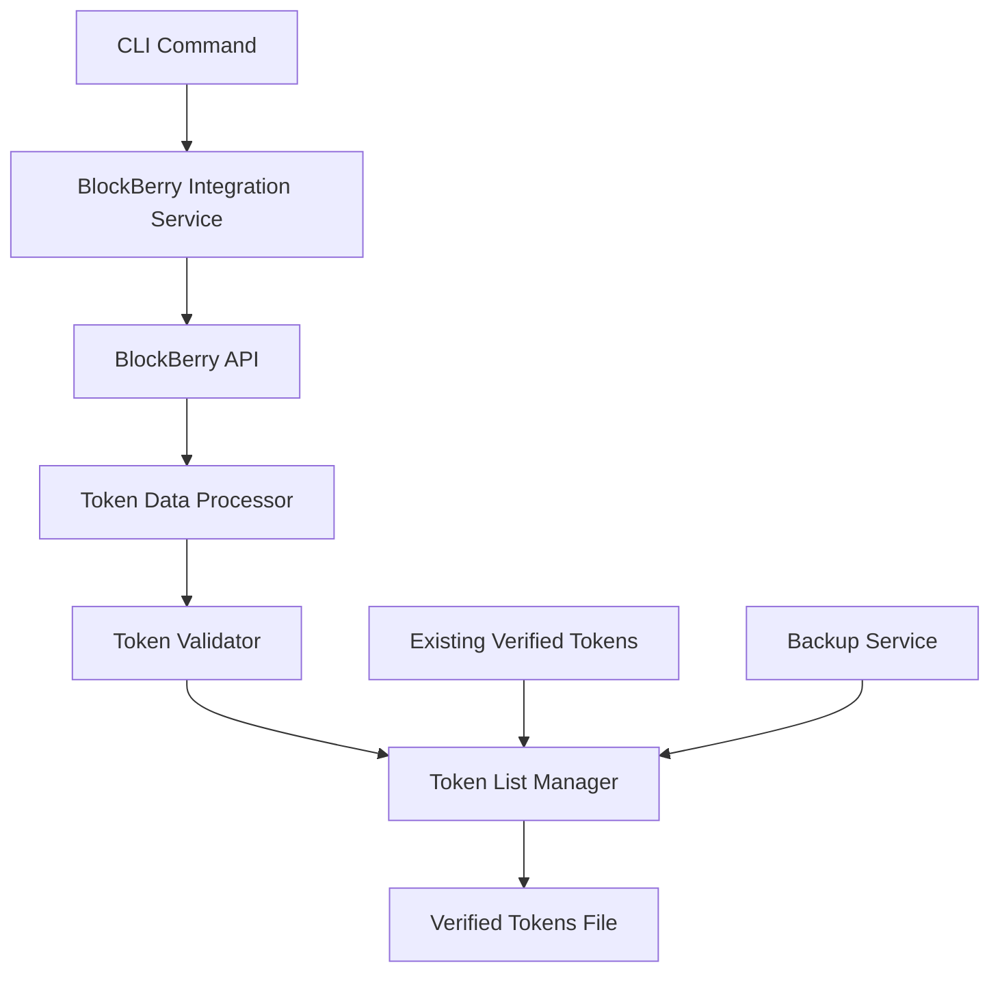

# Design Document

## Overview

The BlockBerry Verified Tokens Integration feature will extend the existing Polar token list system to automatically fetch all 883 verified tokens from the BlockBerry API and integrate them into the verified token list. This design leverages the existing BlockBerry API integration while adding a new workflow specifically for bulk verified token import.

The system will build upon the existing `BlockBerryAPI` class and token management infrastructure, adding a new command and workflow for administrators to populate the verified token list with high-quality, pre-verified tokens from the SUI blockchain.

## Architecture

### High-Level Flow

```
Administrator → CLI Command → BlockBerry Integration → Token Processing → Verified Token List Update
```

### Component Interaction



## Components and Interfaces

### 1. BlockBerry Integration Service

**Purpose:** Orchestrates the entire verified token import process

**Key Methods:**
- `importAllVerifiedTokens()`: Main entry point for the import process
- `fetchVerifiedTokensFromBlockBerry()`: Handles API communication with pagination
- `processTokenBatch()`: Processes batches of tokens for memory efficiency

**Dependencies:**
- Existing `BlockBerryAPI` class
- Token processing utilities
- File system operations

### 2. Token Data Processor

**Purpose:** Converts BlockBerry token format to Polar format and enriches data

**Key Methods:**
- `convertBlockBerryToken(bbToken: BlockBerryToken)`: Converts single token as verification candidate
- `enrichTokenMetadata(token: Token)`: Adds trading metrics and BlockBerry verification status
- `validateTokenData(token: Token)`: Ensures token meets quality standards

**Data Transformation:**
```typescript
BlockBerryToken → {
  name: string,
  symbol: string,
  decimals: number,
  objectId: string (from coin_type),
  logoURI: string (from icon_url),
  verified: false, // Polar still needs to verify
  verifiedBy: "", // Empty until Polar verifies
  tags: ["blockberry-verified", "candidate"], // Candidate for verification
  extensions: {
    website: string,
    description: string,
    marketCap: number,
    volume24h: number,
    holders: number,
    transactions: number,
    blockberryVerified: true, // Track BlockBerry verification status
    addedAt: string
  }
}
```

### 3. Token List Manager

**Purpose:** Manages the verified token list file operations

**Key Methods:**
- `loadExistingTokens()`: Reads current verified-tokens.json
- `mergeTokenLists(existing: Token[], new: Token[])`: Combines token lists without duplicates
- `saveVerifiedTokens(tokens: Token[])`: Writes updated list to file
- `createBackup()`: Creates backup before modifications

**Deduplication Strategy:**
- Use `objectId` as unique identifier
- Preserve existing tokens if they already exist
- Update metadata for existing tokens if BlockBerry data is newer

### 4. Progress and Error Handling

**Logging Strategy:**
- Progress updates every 50 tokens fetched
- Summary statistics at completion
- Error logging with continuation for non-critical failures

**Error Recovery:**
- Continue processing if individual token fails validation
- Retry failed API requests with exponential backoff
- Graceful degradation if API key is missing

## Data Models

### Enhanced Token Interface

The existing `Token` type will be used with these specific field mappings:

```typescript
type BlockBerryImportedToken = Token & {
  verified: false; // Requires Polar verification
  verifiedBy: ""; // Empty until Polar verifies
  tags: ["blockberry-verified", "candidate"];
  extensions: {
    website?: string;
    description?: string;
    marketCap?: number;
    volume24h?: number;
    holders?: number;
    transactions?: number;
    blockberryVerified: true; // Tracks BlockBerry verification status
    addedAt: string;
  };
}
```

### API Response Handling

```typescript
interface BlockBerryPaginatedResponse {
  data: BlockBerryToken[];
  pagination: {
    page: number;
    limit: number;
    total: number;
    has_next: boolean;
  };
}
```

## Error Handling

### API Error Scenarios

1. **Rate Limiting**: Implement exponential backoff with jitter
2. **Network Failures**: Retry with circuit breaker pattern
3. **Invalid Token Data**: Log and skip individual tokens
4. **File System Errors**: Fail fast with clear error messages

### Validation Rules

1. **Required Fields**: name, symbol, decimals, objectId must be present
2. **Data Types**: Ensure numeric fields are valid numbers
3. **Duplicate Detection**: Check objectId against existing tokens
4. **Format Validation**: Ensure objectId follows SUI format patterns

### Recovery Strategies

- **Partial Failure**: Continue processing remaining tokens
- **Complete Failure**: Restore from backup if file was corrupted
- **API Unavailable**: Provide clear instructions for manual retry

## Testing Strategy

### Unit Tests

1. **Token Conversion**: Test BlockBerry to Polar format conversion
2. **Deduplication**: Verify duplicate token handling
3. **Validation**: Test token data validation rules
4. **Error Handling**: Test various error scenarios

### Integration Tests

1. **API Integration**: Test with BlockBerry API (using test data)
2. **File Operations**: Test backup and restore functionality
3. **End-to-End**: Test complete import workflow

### Manual Testing

1. **API Key Scenarios**: Test with and without API key
2. **Large Dataset**: Verify performance with 883 tokens
3. **File Integrity**: Ensure verified-tokens.json remains valid

### Test Data Strategy

- Use mock BlockBerry responses for unit tests
- Create sample token data that covers edge cases
- Test with both empty and populated verified token lists

## Performance Considerations

### Memory Management

- Process tokens in batches of 100 to avoid memory issues
- Stream processing for large datasets
- Garbage collection between batches

### API Rate Limiting

- 500ms delay between API calls (as implemented)
- Respect BlockBerry API rate limits
- Exponential backoff for rate limit errors

### File I/O Optimization

- Single backup creation at start
- Atomic file writes to prevent corruption
- JSON streaming for large files if needed

## Security Considerations

### API Key Management

- Read API key from environment variables only
- Never log or expose API keys
- Graceful handling when API key is missing

### Data Validation

- Sanitize all input from BlockBerry API
- Validate URLs and external references
- Prevent injection attacks through token metadata

### File System Security

- Validate file paths to prevent directory traversal
- Ensure proper file permissions
- Atomic operations to prevent race conditions