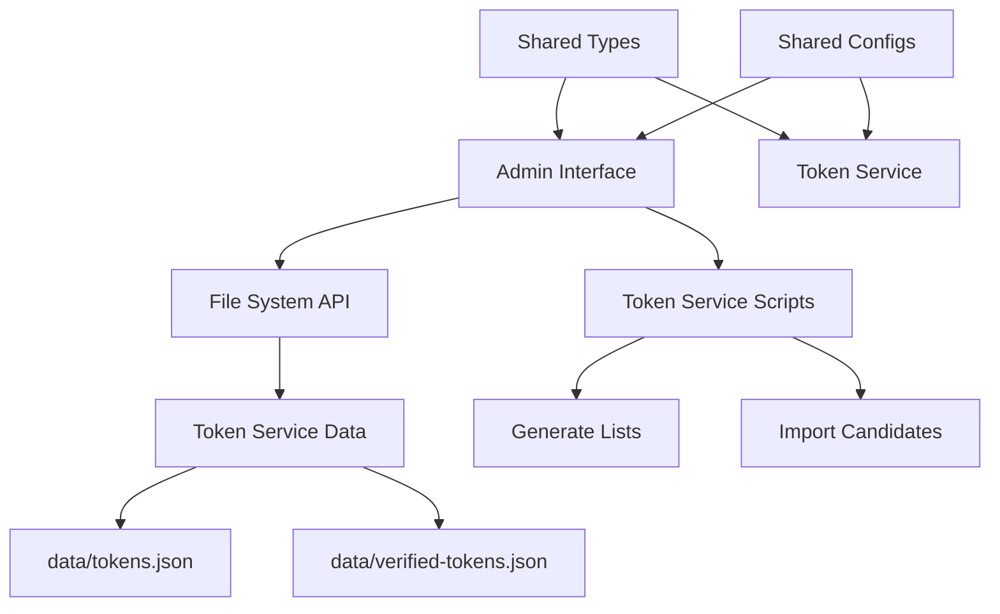

# Design Document

## Overview

This design transforms the existing polar-token-list repository into a monorepo containing two main projects: the existing token list service and a new React-based admin interface. The structure will use yarn workspaces for dependency management and provide a clean separation of concerns while enabling shared tooling and configurations.

## Architecture

### Monorepo Structure

```
polar-token-list/
├── packages/
│   ├── token-service/          # Existing Node.js service (moved)
│   │   ├── src/
│   │   ├── data/
│   │   ├── dist/
│   │   └── package.json
│   └── admin-interface/        # New React admin app
│       ├── src/
│       ├── public/
│       ├── dist/
│       └── package.json
├── shared/                     # Shared configurations and types
│   ├── types/
│   ├── configs/
│   └── utils/
├── package.json               # Root workspace configuration
├── yarn.lock
└── README.md
```

### Component Interaction



## Components and Interfaces

### 1. Monorepo Root Configuration

**Purpose:** Manages workspace dependencies and shared tooling

**Key Files:**
- `package.json`: Workspace configuration with yarn workspaces
- `tsconfig.json`: Base TypeScript configuration
- `.eslintrc.js`: Shared linting rules
- `.prettierrc`: Shared formatting configuration

**Workspace Scripts:**
```json
{
  "scripts": {
    "build": "yarn workspaces run build",
    "dev": "yarn workspace admin-interface dev",
    "token-service": "yarn workspace token-service",
    "admin": "yarn workspace admin-interface",
    "generate-lists": "yarn workspace token-service generate",
    "import-candidates": "yarn workspace token-service import-verified-candidates"
  }
}
```

### 2. Token Service Package (Existing Code)

**Purpose:** Maintains existing functionality in new location

**Migration Strategy:**
- Move existing `src/`, `data/`, `dist/` to `packages/token-service/`
- Update package.json with workspace-specific configuration
- Adjust import paths and build outputs
- Maintain all existing scripts and functionality

**Package Configuration:**
```json
{
  "name": "@polar/token-service",
  "private": true,
  "main": "dist/index.js",
  "scripts": {
    "build": "tsc -p tsconfig.json",
    "generate": "yarn build && node dist/generators/all-list.js && ...",
    "import-verified-candidates": "yarn build && node dist/scripts/import-verified-candidates.js"
  }
}
```

### 3. Admin Interface Package

**Purpose:** React-based web interface for token management

**Technology Stack:**
- React 18 with TypeScript
- Vite for build tooling and dev server
- Tailwind CSS for styling
- React Query for data fetching
- React Router for navigation
- Zustand for state management

**Key Components:**

#### Dashboard Layout
```typescript
interface DashboardProps {
  children: React.ReactNode;
}

const Dashboard: React.FC<DashboardProps> = ({ children }) => {
  return (
    <div className="min-h-screen bg-gray-50">
      <Sidebar />
      <main className="ml-64 p-8">
        {children}
      </main>
    </div>
  );
};
```

#### Token Candidate List
```typescript
interface TokenCandidateListProps {
  tokens: Token[];
  onApprove: (tokenId: string) => void;
  onReject: (tokenId: string) => void;
}

const TokenCandidateList: React.FC<TokenCandidateListProps> = ({
  tokens,
  onApprove,
  onReject
}) => {
  // Implementation for displaying and managing token candidates
};
```

#### Token Details Modal
```typescript
interface TokenDetailsProps {
  token: Token;
  isOpen: boolean;
  onClose: () => void;
  onApprove: () => void;
  onReject: () => void;
}
```

### 4. File System Integration

**Purpose:** Bridge between React interface and token service data

**API Layer:**
```typescript
class TokenFileAPI {
  async getCandidateTokens(): Promise<Token[]>;
  async getVerifiedTokens(): Promise<Token[]>;
  async approveToken(tokenId: string, adminId: string): Promise<void>;
  async rejectToken(tokenId: string, reason: string): Promise<void>;
  async bulkApprove(tokenIds: string[], adminId: string): Promise<void>;
  async regenerateLists(): Promise<void>;
}
```

**File Operations:**
- Read from `packages/token-service/data/tokens.json`
- Write to `packages/token-service/data/verified-tokens.json`
- Trigger token list regeneration via token service scripts
- Handle concurrent access and file locking

### 5. Shared Types and Utilities

**Purpose:** Common interfaces and utilities used by both packages

**Shared Types:**
```typescript
// shared/types/token.ts
export interface Token {
  name: string;
  symbol: string;
  decimals: number;
  objectId: string;
  logoURI?: string;
  verified: boolean;
  verifiedBy?: string;
  addedAt: string;
  tags?: string[];
  extensions?: TokenExtensions;
}

export interface TokenExtensions {
  website?: string;
  twitter?: string;
  description?: string;
  qualityScore?: number;
  blockberryVerified?: boolean;
}
```

**Shared Utilities:**
```typescript
// shared/utils/validation.ts
export const validateToken = (token: Token): ValidationResult => {
  // Shared validation logic
};

// shared/utils/file-operations.ts
export const safeFileWrite = async (path: string, data: any): Promise<void> => {
  // Atomic file operations
};
```

## Data Models

### Admin Interface State

```typescript
interface AdminState {
  candidateTokens: Token[];
  verifiedTokens: Token[];
  selectedTokens: string[];
  filters: TokenFilters;
  sortBy: SortOption;
  isLoading: boolean;
  error: string | null;
}

interface TokenFilters {
  search: string;
  qualityScore: [number, number];
  tags: string[];
  verificationStatus: 'all' | 'candidates' | 'verified';
}
```

### File System Operations

```typescript
interface FileOperation {
  type: 'approve' | 'reject' | 'bulk-approve' | 'regenerate';
  payload: any;
  timestamp: string;
  adminId: string;
}

interface OperationResult {
  success: boolean;
  message: string;
  affectedTokens: number;
  errors?: string[];
}
```

## Error Handling

### File System Errors

1. **Concurrent Access**: Implement file locking mechanism
2. **Permission Errors**: Graceful degradation with clear error messages
3. **Corruption Recovery**: Backup and restore functionality
4. **Network Issues**: Retry logic for file operations

### React Error Boundaries

```typescript
class TokenManagementErrorBoundary extends React.Component {
  // Handle errors in token management operations
  // Provide fallback UI and error reporting
}
```

### API Error Handling

```typescript
const useTokenOperations = () => {
  const mutation = useMutation({
    mutationFn: approveToken,
    onError: (error) => {
      // Handle and display errors
      toast.error(`Failed to approve token: ${error.message}`);
    },
    onSuccess: () => {
      // Refresh data and show success message
      queryClient.invalidateQueries(['tokens']);
      toast.success('Token approved successfully');
    }
  });
};
```

## Testing Strategy

### Token Service Testing

- Maintain existing test structure
- Update import paths after migration
- Add integration tests for file operations
- Test workspace script execution

### Admin Interface Testing

```typescript
// Component testing with React Testing Library
describe('TokenCandidateList', () => {
  it('should display token candidates', () => {
    render(<TokenCandidateList tokens={mockTokens} />);
    expect(screen.getByText('SUI Token')).toBeInTheDocument();
  });

  it('should handle approve action', async () => {
    const onApprove = jest.fn();
    render(<TokenCandidateList tokens={mockTokens} onApprove={onApprove} />);
    
    fireEvent.click(screen.getByText('Approve'));
    expect(onApprove).toHaveBeenCalledWith('token-id');
  });
});
```

### Integration Testing

- Test file system operations between packages
- Verify workspace script execution
- Test data flow from token service to admin interface

## Performance Considerations

### File System Operations

- Implement caching for frequently accessed token data
- Use streaming for large token lists
- Batch file operations to reduce I/O
- Implement debouncing for rapid user actions

### React Performance

- Use React.memo for expensive components
- Implement virtualization for large token lists
- Optimize re-renders with proper dependency arrays
- Use React Query for efficient data caching

### Build Optimization

- Separate build processes for each package
- Implement incremental builds
- Use code splitting in React app
- Optimize bundle sizes with tree shaking

## Security Considerations

### File System Access

- Validate all file paths to prevent directory traversal
- Implement proper file permissions
- Use atomic operations to prevent corruption
- Sanitize all user input before file operations

### Admin Authentication

- Implement admin authentication system
- Track all verification actions with audit logs
- Implement role-based permissions
- Secure API endpoints with proper authorization

### Data Validation

- Validate all token data before processing
- Sanitize user inputs in admin interface
- Implement CSRF protection
- Use secure HTTP headers